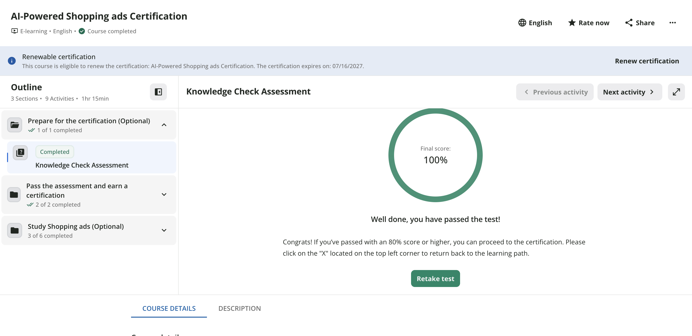

## Certification Proof

I completed the **AI-Powered Shopping Ads Certification** through Google Skillshop, passing the Knowledge Check Assessment with a **final score of 100%**. The certification is renewable and is valid through 07/16/2027.

{fig-alt="Screenshot of Google Skillshop showing AI-Powered Shopping Ads Certification course completed with a Knowledge Check Assessment final score of 100 percent"}

## Final Application Summary

The Google Shopping Ads Certification deepened my understanding of how retailers move products from a static catalog into an active, algorithm-driven advertising system, knowledge that connects directly to the omnichannel work my group has been doing for the CPP Farm Store.

### Three concepts I found most useful

First, the relationship between product feed quality and ad performance: Shopping Ads pull directly from structured data (titles, GTINs, product categories, availability) rather than manually written ad copy, so a well-optimized feed *is* the ad. Second, the shift toward Performance Max as a campaign type that blends Shopping, Display, Search, and YouTube inventory under one automated bidding structure — a change from the channel-siloed thinking I came in with. Third, the role of retail media as a measurement layer: conversion tracking, attribution windows, and ROAS reporting aren't afterthoughts, they're what let a retailer justify (or cut) ad spend with real numbers instead of guesswork.

### Connecting it to CPP Farm Store's omnichannel opportunity

The Farm Store's biggest gap right now is that its product catalog exists but isn't structured for discovery outside the Shopify storefront itself. Learning how Google Merchant Center evaluates feed data — required attributes, image quality, GTIN/brand fields — gave me a much clearer picture of *why* our GP3 feed-building work mattered, not just *how* to do it. It also reframed the Farm Store's opportunity: gift baskets are a visually strong, seasonally relevant product that could perform well in Shopping ads specifically because they photograph well and have clear, describable attributes (contents, occasion, price point) — exactly what the algorithm rewards.

### How I applied this to the group project

On GP3, I used what I learned about title optimization and required feed attributes directly in building out the Google Merchant Center product feed spreadsheet, which fed into our presentation slides. On GP4, this certification also shaped how I approached the dashboard KPIs I'm building for Steps 4–5 — specifically thinking about Click-Through Rate (Google Shopping) and Store Pickup Interest as connected to actual ad-serving mechanics rather than just abstract analytics metrics.

### What I feel more confident discussing

I can now speak professionally about Shopping campaign structure, feed optimization requirements, and how Performance Max consolidates channels — topics that came up as gaps in earlier group discussions about paid media strategy.

### Resume / LinkedIn framing

I'd describe this as: *"Google Shopping Ads Certified — product feed optimization, Performance Max campaign strategy, and retail media measurement."* Given the social-media-forward, lifestyle/entertainment roles I'm targeting, this certification pairs well with my HubSpot Inbound Marketing certification to signal both content-side and paid-media fluency — useful for coordinator roles that increasingly expect some comfort with paid social and shopping feeds even in primarily organic/content positions.

## Appendix

- **GitHub Pages:** [ADD YOUR PUBLISHED URL HERE]
- **GitHub Repo:** [ADD YOUR REPO URL HERE]
